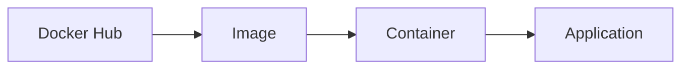
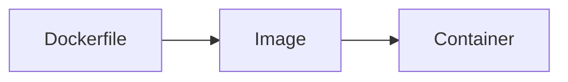
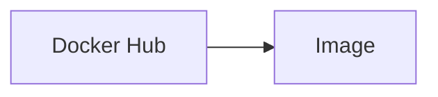
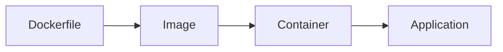
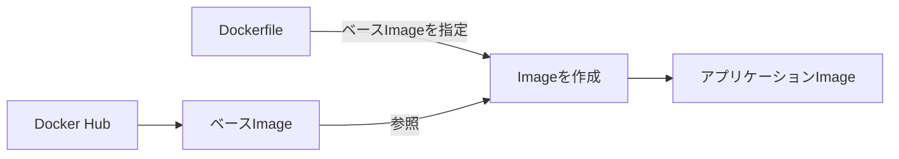
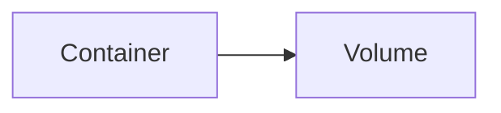
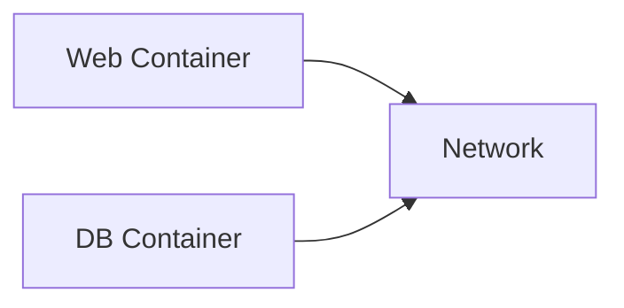
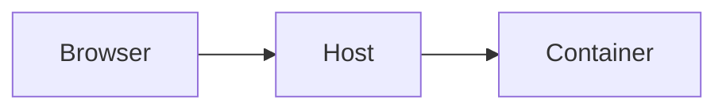
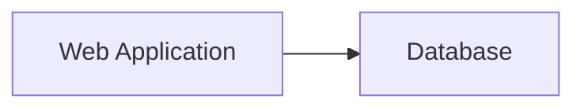

:::note info
本記事はDocker公式ドキュメントを参考にしつつ、
ChatGPTを利用して構成検討および文章作成を行いました。
内容については筆者が確認・修正しています。
:::

# Dockerとは

現在のソフトウェア開発では、一つのアプリケーションを複数人で開発することが一般的である。また、開発環境だけでなく、試験環境や本番環境など複数の実行環境で同じアプリケーションを動作させる必要がある。
しかし、アプリケーションは単にソースコードだけで動作するわけではない。実行するためには、プログラミング言語の実行環境やライブラリ、各種設定ファイルなどが必要となる。
例えば、ある開発者のPCではPython 3.11が利用されているが、別の開発者のPCではPython 3.9が利用されているとする。このような状況では、同じソースコードであっても動作結果が異なったり、場合によっては実行できなかったりすることがある。
この問題は開発現場で頻繁に発生し、「自分の環境では動く」という言葉で表現されることが多い。

## 従来の課題

Dockerが登場する以前は、開発手順書を整備することで環境差異を解消しようとしていた。
例えば、次のような手順書が配布されることがある。

1. Java 17をインストールする
1. Mavenをインストールする
1. PostgreSQLをインストールする
1. 設定ファイルを配置する
1. データベースを作成する

しかし、利用するOSやソフトウェアのバージョンによって手順が変わることがあり、手順書通りに作業しても同じ環境にならない場合があった。
その後、仮想マシン（Virtual Machine）を利用して環境を丸ごと配布する方法も広く利用されるようになった。しかし、仮想マシンはOSそのものを起動するため、多くのメモリやストレージを必要とするという課題があった。

## Dockerによる解決

Dockerは、アプリケーションとその実行環境を一つの単位としてまとめて管理するためのプラットフォームである。
Dockerでは、アプリケーションの実行に必要なライブラリや設定をコンテナとして管理する。
開発者はDockerで作成されたコンテナを実行するだけでよく、複雑な環境構築手順を個別に実施する必要がなくなる。
これにより、開発者ごとの環境差異を減らし、開発環境・試験環境・本番環境で同じアプリケーションを動作させやすくなる。

## Dockerの利用例

現在では、多くのシステムでDockerが利用されている。
例えば、Webアプリケーションを開発する場合には、Webサーバ、アプリケーションサーバ、データベースサーバをそれぞれコンテナとして起動することができる。
また、クラウドサービスやCI/CD環境でもDockerは広く採用されており、コンテナ技術は現代のシステム開発における重要な基盤技術の一つとなっている。

# コンテナとは

Dockerを理解するためには、まず「コンテナ」という考え方を理解する必要がある。
従来、アプリケーションごとに独立した実行環境を用意する方法として仮想マシンが利用されていた。仮想マシンでは、ホストOS上に仮想的なコンピュータを作成し、その中で別のOSを動作させる。
仮想マシンは高い独立性を持つ一方で、OSそのものを起動する必要があるため、メモリやストレージを多く消費するという特徴がある。
一方、DockerのコンテナはホストOSのカーネルを共有して動作する。そのため、仮想マシンと比較して起動が高速であり、必要なリソースも少ない。
このような特徴から、現在のクラウドサービスやWebシステム開発ではコンテナ技術が広く利用されている。

# イメージとコンテナ

Dockerを利用する上で、最初に理解しておきたいのが「イメージ（Image）」と「コンテナ（Container）」の違いである。
Dockerの操作では頻繁にこれらの用語が登場するが、初学者は両者を混同しやすい。しかし、この違いを理解できるとDockerの仕組みが非常に分かりやすくなる。
イメージとは、コンテナを作成するための設計図である。アプリケーション本体や必要なライブラリ、設定情報などが含まれており、コンテナを起動するための元データとなる。
一方、コンテナとはイメージから作成された実行環境である。実際にプログラムが動作している状態を指す。
例えば、建築に例えると、イメージは住宅の設計図であり、コンテナはその設計図をもとに建てられた実際の住宅である。
設計図から複数の住宅を建てられるように、1つのイメージから複数のコンテナを作成することもできる。

```bash
Image
 │
 ├─ Container A
 │ 
 ├─ Container B 
 │ 
 └─ Container C
```

Dockerでは、まずイメージを取得し、そのイメージからコンテナを作成して実行する。
例えば、次のコマンドを実行すると、Dockerは「hello-world」というイメージを利用してコンテナを起動する。

```bash
docker run hello-world
```

初回実行時には、ローカル環境にイメージが存在しないため、自動的にDocker Hubからイメージが取得される。その後、取得したイメージをもとにコンテナが作成され、プログラムが実行される。
この一連の流れを図で表すと次のようになる。



実際の運用では、コンテナは作成・停止・削除を繰り返すことが多い。一方で、イメージはコンテナの元となるため、何度でも再利用できる。
そのため、Dockerを学習する際は次の考え方を覚えておくとよい。

- イメージは設計図
- コンテナは実行中の実体
- コンテナはイメージから作られる
- 1つのイメージから複数のコンテナを作成できる

次章では、実際にDockerをインストールし、コンテナを起動しながらイメージとコンテナの関係を確認する。

# Dockerの構成要素

前章では、Dockerにおけるイメージとコンテナの関係について学習した。
Dockerを利用する際には、イメージやコンテナ以外にもいくつかの重要な構成要素が存在する。これらの役割を理解しておくことで、Docker関連の資料や設計書を読みやすくなる。

## Docker Engineとは

Docker EngineはDockerの中核となるソフトウェアである。コンテナの作成や起動、停止などの処理を担当しており、Dockerの機能の多くはDocker Engineによって実現されている。
利用者はDocker Engineに対してコマンドを発行し、その結果としてコンテナが管理される。

## Docker Hubとは

次に、Docker Hubについて見てみよう。
Docker HubはDockerイメージを保管するための公開レジストリである。レジストリとは、Dockerイメージを保存・配布するための仕組みを指す。
ソフトウェア開発で利用されるソースコード管理システムにGitHubがあるように、Dockerイメージを共有するためのサービスとしてDocker Hubが存在している。
Docker Hubには、Webサーバやデータベースなど、さまざまな用途の公式イメージが公開されている。そのため、利用者はゼロから環境を構築するのではなく、既存のイメージを活用しながらシステムを構築できる。
また、Dockerではイメージを自作することもできる。

## Dockerfileとは

イメージの作成手順を記述するためのファイルをDockerfileという。
Dockerfileには、どのOSイメージを利用するか、どのファイルを配置するか、どのプログラムを実行するかといった情報を記述する。
DockerはDockerfileを読み取り、その内容に従ってイメージを作成する。
このように考えると、それぞれの役割は次のように整理できる。




Dockerfileからイメージを作成し、そのイメージからコンテナを生成する。また、Docker Hubには作成済みのイメージが保存されており、必要に応じて取得して利用できる。
ここまでの内容をまとめると、Dockerには以下の構成要素が存在する。

- Docker Engine
  コンテナを管理するソフトウェア
- Dockerfile
  イメージの作成手順を記述するファイル
- Image
  コンテナの設計図
- Container
  イメージから作成された実行環境
- Docker Hub
  イメージを保管する公開レジストリ

これらの関係性を理解することで、Dockerがどのようにアプリケーションを管理しているのかを把握しやすくなる。
次章では、Dockerがどのような流れでイメージを作成し、コンテナを利用するのかについて学習する。

# Dockerの利用イメージ

これまでに、Dockerを構成する主な要素としてDockerfile、イメージ、コンテナ、Docker Hubについて学習した。
しかし、これらの要素がどのような順番で利用されるのかが分からないと、Docker全体の流れをイメージしにくい。
そこで本章では、Dockerを利用する際の一般的な流れについて確認する。

1. Dockerfileの作成
  Dockerを利用する場合、多くのケースではまずDockerfileを作成する。Dockerfileにはアプリケーションを実行するために必要な情報を記述する。
  例えば、どのベースイメージを利用するか、アプリケーションのファイルをどこに配置するか、起動時にどのプログラムを実行するかなどを定義する。
1. イメージの作成
  Dockerはその内容をもとにイメージを作成する。
  イメージは、アプリケーションを実行するために必要な情報をまとめたものであり、まだ実行されていない状態で保存される。
1. コンテナの作成
  その後、作成したイメージからコンテナを生成する。
  コンテナは実際にアプリケーションが動作する環境であり、利用者がサービスへアクセスする際には、このコンテナ内でプログラムが実行されている。

流れを図で表すと次のようになる。


一方で、毎回Dockerfileからイメージを作成するとは限らない。
Docker Hubには多くの公開イメージが用意されており、それらを利用することで簡単に環境を準備できる。

次章では、Hubの内容も含めDockerfileについて学習する

# Dockerfile

これまでに、Dockerではイメージからコンテナを作成することを学習した。
では、そのイメージはどのように作成されるのだろうか。
Dockerでは、イメージの作成手順を記述したファイルとしてDockerfileを利用する。Dockerfileには、どのイメージを土台として利用するか、どのファイルを配置するか、コンテナ起動時にどのプログラムを実行するかなどを記述する。
DockerはDockerfileの内容を読み取り、その手順に従ってイメージを作成する。
イメージ作成の流れを簡略化すると、次のようになる。

Dockerfileによってイメージを作成するといっても、多くの場合はゼロから環境を構築するわけではない。
例えば、Pythonアプリケーションを実行したい場合はPythonがインストールされたイメージを利用し、Webサーバを構築したい場合はNginxのイメージを利用する。
このようなイメージはDocker Hubで公開されており、Dockerfileからベースイメージとして利用できる。
Dockerfileでは、利用するベースイメージを`FROM`命令で指定する。
```bash
FROM python:3.11-slim
```
この例では、Docker Hubで公開されている`python:3.11-slim`イメージを土台として利用している。
また、アプリケーションのソースコードを配置する場合は`COPY`命令を利用する。
```bash
COPY . .
```
さらに、コンテナ起動時に実行するプログラムは`CMD`命令で指定する。
```bash
CMD ["python", "app.py"]
```
これらを組み合わせることで、アプリケーションを実行するためのイメージを作成できる。
例えば、簡単なPythonアプリケーションを実行するDockerfileは次のようになる。
```bash
FROM 
python:3.11-slim 
WORKDIR /app 
COPY . . 
CMD ["python", "app.py"]
```
Dockerfileを利用することで、アプリケーションの実行環境を手順として記録できるようになる。
その結果、開発者ごとに環境構築を行う必要がなくなり、誰でも同じイメージを作成できるようになる。
次章では、コンテナを削除してもデータを保持するためのVolumeについて学習する。

# Volume

これまでの章では、Dockerfileからイメージを作成し、そのイメージからコンテナを実行できることを学習した。
しかし、コンテナには一つ特徴がある。
それは、コンテナ内のデータが永続的に保持されるとは限らないということである。
例えば、コンテナ内でファイルを作成したり、データベースにデータを保存したりした場合でも、コンテナを削除するとそれらのデータが失われることがある。
これはコンテナが「使い捨て可能な実行環境」として設計されているためである。
アプリケーションの実行環境を再作成しやすくするため、コンテナ自体には重要なデータを保存しない考え方が採用されている。
しかし、実際のシステムではデータを保持する必要がある。
例えば、データベースの登録情報やユーザーがアップロードしたファイルなどは、コンテナを再作成しても残っていてほしい。
そこで利用されるのがVolumeである。

Volumeはコンテナとは独立して管理される保存領域であり、コンテナが削除されてもデータを保持できる。
そのため、データベースやファイルサーバなどの永続的なデータを扱うシステムではVolumeが重要な役割を持つ。
概念的には次のような構成になる。

コンテナはVolumeに保存されたデータを利用するが、Volume自体はコンテナとは別に管理される。
そのため、コンテナを作り直しても同じVolumeを利用すれば、以前のデータを引き継ぐことができる。
例えば、アプリケーションのバージョンアップに伴いコンテナを再作成する場合でも、Volumeを利用していれば保存されたデータをそのまま利用できる。
Dockerを利用する際は、

- アプリケーションはコンテナに配置する
- 失いたくないデータはVolumeに保存する

という考え方を意識するとよい。
次章では、コンテナ同士や外部からの通信を実現するためのネットワークについて学習する。

# Network

これまでの章では、コンテナの作成方法やデータの保存方法について学習した。
しかし、アプリケーションは単独で動作するとは限らない。
例えば、Webアプリケーションはデータベースと通信しながら動作することが多く、利用者はブラウザからWebサーバへアクセスする必要がある。
このような通信を実現するために利用されるのがDocker Networkである。

Dockerでは、コンテナごとに独立したネットワーク空間が作成される。そのため、コンテナ内で利用される`localhost`は、そのコンテナ自身を指している。
例えば、Webアプリケーションのコンテナから`localhost`に接続した場合、接続先はWebアプリケーションのコンテナ自身となる。
そのため、別のコンテナで動作しているデータベースへ接続することはできない。

コンテナ同士を通信させる場合は、同じネットワークへ参加させる必要がある。


同じネットワークに接続されたコンテナ同士は互いに通信できるようになる。
また、利用者がブラウザからコンテナ内のアプリケーションへアクセスする場合には、コンテナのポートを公開する必要がある。

ポート公開を行うことで、コンテナ内部で動作しているWebアプリケーションへ外部からアクセスできるようになる。
Dockerを利用し始めたばかりの頃は、「コンテナ内のlocalhostはホストPCではない」という点で混乱しやすい。

しかし、

- コンテナは独立した実行環境である
- コンテナごとにネットワークが分離されている
- 通信にはネットワーク参加やポート公開が必要である

という考え方を理解すると、Dockerのネットワーク構成を把握しやすくなる。
次章では、複数のコンテナをまとめて管理するためのDocker Composeについて学習する。

# Docker Compose

前章では、コンテナごとに独立したネットワーク空間を持ち、コンテナ同士が通信するためには適切なネットワーク設定が必要であることを学習した。
しかし、実際のシステムは単一のコンテナだけで構成されるとは限らない。
例えば、Webアプリケーションを動作させる場合、

- Webサーバ
- アプリケーションサーバ
- データベースサーバ

といった複数のコンテナが連携して動作することが一般的である。
これらを個別に作成・起動・停止することも可能だが、構成が複雑になるにつれて管理が難しくなる。
そこで利用されるのがDocker Composeである。
Docker Composeは、複数のコンテナを1つのシステムとして管理するための仕組みである。
利用者は compose.yml ファイルにシステム構成を記述し、その内容に従ってDockerがコンテナやネットワークを作成する。
例えば、Webアプリケーションとデータベースを組み合わせた構成は次のように表現できる。

Docker Composeでは、このような構成を1つの設定ファイルとして管理できる。
また、Composeによって作成されたコンテナは、同じネットワークに参加する。
そのため、Webアプリケーションからデータベースへ通信する際に、IPアドレスを意識する必要がなくなる。

利用者はコンテナ名やサービス名を利用して通信できるため、システム構成を分かりやすく管理できる。
Docker Composeを利用することで、

- システム構成を設定ファイルとして管理できる
- 複数のコンテナをまとめて起動・停止できる
- コンテナ間通信を容易に構成できる

といった利点が得られる。
Dockerを利用した開発では、単体のコンテナを扱うよりもDocker Composeによって複数のコンテナを管理する場面の方が多い。
そのため、Docker ComposeはDockerを実践的に利用する上で重要な仕組みの一つである。

# よくある失敗

Dockerは環境構築やシステム運用を効率化できる便利な技術である。
しかし、Docker特有の考え方に慣れていない場合、思わぬ問題に遭遇することがある。
本章では、初学者が遭遇しやすい代表的な失敗例を紹介する。

### localhostで接続できない

Dockerを利用し始めた際に最も多い問題の一つが、localhostによる接続である。
コンテナ内で利用されるlocalhostは、そのコンテナ自身を指している。
そのため、Webアプリケーションコンテナからlocalhostを指定しても、別のコンテナで動作しているデータベースへは接続できない。
コンテナ間で通信する場合は、同じネットワークへ参加させたうえで、サービス名やコンテナ名を利用して通信する必要がある。

### コンテナを削除したらデータが消えた

コンテナは使い捨て可能な実行環境として設計されている。
そのため、コンテナ内だけに保存されたデータは、コンテナ削除時に失われる場合がある。
重要なデータを保存する場合は、Volumeなどの永続化機能を利用する必要がある。

### ImageとContainerを混同する

Dockerの学習初期には、ImageとContainerの違いが分かりにくい。
Imageは設計図であり、Containerは実行環境である。
Containerを削除してもImageは残る。
また、同じImageから複数のContainerを作成することも可能である。
両者の役割を区別して考えることが重要である。

### Dockerfileを変更してもContainerに反映されない

DockerfileはImageを作成するための手順書である。
そのため、Dockerfileを変更しただけでは、既存のContainerには変更が反映されない。
変更内容を反映するためには、新しいImageを作成し、そのImageからContainerを再作成する必要がある。

### ポート公開を忘れる

コンテナ内でWebアプリケーションが正常に起動していても、外部からアクセスできない場合がある。
その原因の一つがポート公開の設定漏れである。
Dockerでは、コンテナ内部のポートとホスト側のポートを明示的に関連付ける必要がある。
アプリケーションが起動していることと、外部からアクセスできることは別の問題である点に注意する。

# 本書のまとめ

本書では、Dockerの基本的な考え方と主要な構成要素について学習した。
Dockerは単なるアプリケーション実行ツールではなく、アプリケーションとその実行環境をまとめて管理するための仕組みである。
Dockerを利用することで、開発者ごとの環境差異を減らし、同じアプリケーションを異なる環境でも再現しやすくなる。
本書では、まずコンテナの概念を学び、その後Dockerを構成する各要素について確認した。
Dockerfileはイメージを作成するための手順書であり、イメージはコンテナの設計図となる。そして、コンテナは実際にアプリケーションが動作する実行環境である。
また、コンテナは独立した環境として動作するため、ネットワークやデータの扱い方にも特徴がある。
Volumeを利用することでコンテナとは独立してデータを保持でき、Networkを利用することでコンテナ同士や外部との通信を実現できる。
さらに、Docker Composeを利用することで、複数のコンテナを1つのシステムとして管理できることを学習した。
Dockerを学習し始めたばかりの頃は、多くの用語や仕組みに戸惑うことがある。しかし、Dockerの基本的な流れは非常にシンプルである。

まずDockerfileからイメージを作成し、そのイメージからコンテナを作成する。この流れを理解することがDocker学習の第一歩となる。
また、問題が発生した場合は、次の3つの考え方を思い出してほしい。

- コンテナは独立した実行環境である
- コンテナは使い捨て可能な存在である
- イメージからコンテナが作成される

Dockerに関する多くの問題は、これらの考え方を基準に整理することで原因を特定しやすくなる。
本書で学習した内容はDockerの基礎である。しかし、この基礎を理解していれば、より大規模なコンテナ運用技術やクラウドサービスの学習にも取り組みやすくなる。
まずは実際にコンテナを作成し、動かしながらDockerの仕組みに慣れていこう。

# 参考文献

[^1]: Docker公式
  https://docs.docker.com/get-started
